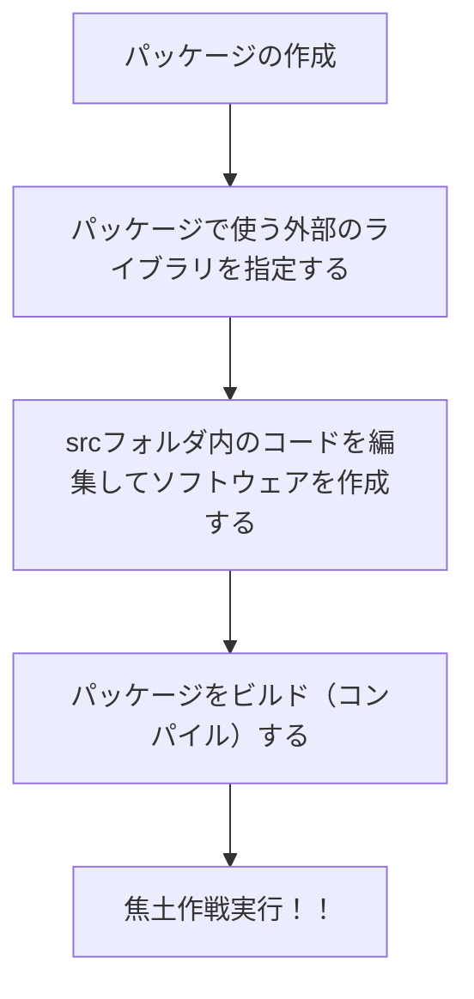

# Welcome to FLS!!
FLSとはWindowsとUbuntu22.04を対象としたプロセス間通信ライブラリです。

環境構築とコーディングの容易さを両立することを目的として開発しました。
使用言語はRustで「Rustを先日初めて知ったよ！」みたいなレベルでも開発可能であると自負しております。

この資料を読んで***FlexLinkSystem***、通称***FLS***への理解を深め開発に参加してくれることを願っています。

## このライブラリの意味
ずばり、**このライブラリがどのような機能を持つのか**ということについての解析です。

プログラミングをするときには色々な開発方法があると思いますが、このライブラリでは共同開発に適した開発方法であるパッケージ開発をサポートしております。

### パッケージ開発ってなんぞや

上記にパッケージ開発の核となるような部分について示しました。

ここでいう**パッケージ**とは**パッケージ**で使いたいライブラリを指定しているファイルとソフトウェアを構造するソースコードを含んだフォルダのことを示します。

また**ライブラリ**とは外部のソースコードを示します。ソフトウェア開発の際には０から１００まですべて自分で書いているというわけではありません。開発を高速に行うためにも**誰かが書いたことのあるコードは引用したい**ものです。そんなときにソフトウェアにおける**ライブラリ**機能が役立ちます。***人が書いたコードを引用するときにライブラリを用いるということです。***