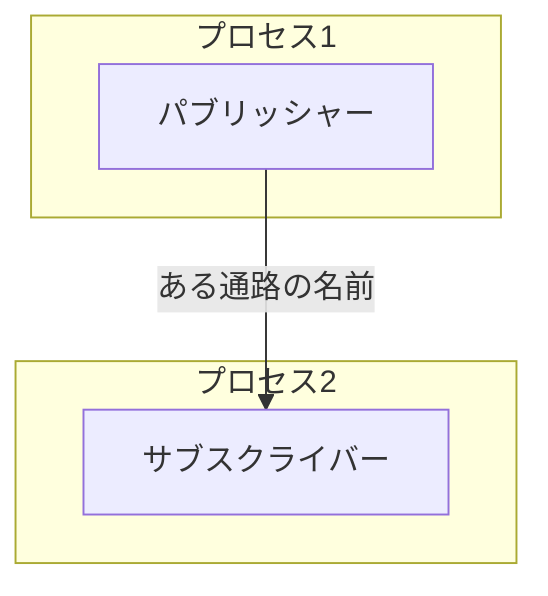
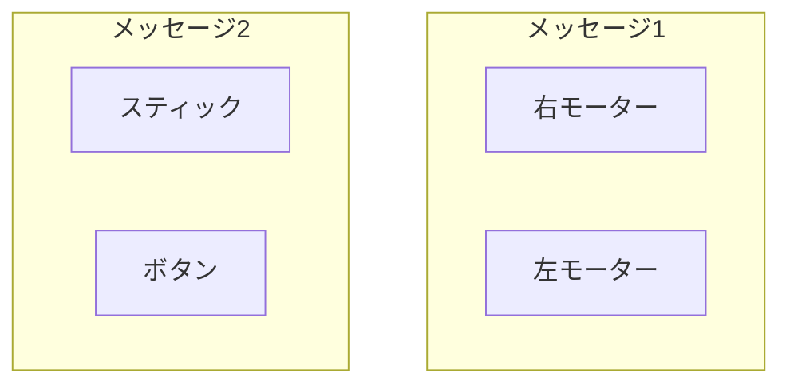

# FLSのご紹介
FLSとはWindowsとUbuntu22.04を対象としたプロセス間通信ライブラリです。

環境構築とコーディングの容易さを両立することを目的として開発しました。
使用言語はRustで「Rustを先日初めて知ったよ！」みたいなレベルでも開発可能であると自負しております。

この資料を読んで***FlexLinkSystem***、通称***FLS***への理解を深め開発に参加してくれることを願っています。

# このライブラリの意味
ずばり、<u>**このライブラリがどのような機能を持つのか**</u>ということについての解析です。

プログラミングをするときには色々な開発方法があると思いますが、このライブラリでは共同開発に適した開発方法であるパッケージ開発をサポートしております。

## パッケージ開発ってなんぞや

上記にパッケージ開発の核となるような部分について示しました。

ここでいう<u>**パッケージ**</u>とは<u>**パッケージ**</u>で使いたいライブラリを指定しているファイルとソフトウェアを構造するソースコードを含んだフォルダのことを示します。

また<u>**ライブラリ**</u>とは外部のソースコードを示します。ソフトウェア開発の際には０から１００まですべて自分で書いているというわけではありません。開発を高速に行うためにも<u>**誰かが書いたことのあるコードは引用したい**</u>ものです。そんなときにソフトウェアにおける<u>**ライブラリ**</u>機能が役立ちます。<u>**人が書いたコードを引用するときにライブラリを用いるということです。**</u>

最後に<u>**ビルド**</u>についてです。通常、授業などでプログラムを機械語に翻訳することを<u>**コンパイル**</u>と呼ぶと思います。ですがパッケージで開発しているときには先述したライブラリをインストールしたりする操作も含みます。よってそれらの操作をまとめて<u>**ビルド**</u>と呼んでいるのだなと私は理解しています。

## プロセスとスレッド
**プロセス**と**スレッド**についても軽く解説しておきます。

プロセスとはソフトウェアの単位のようなもので以下のような感じで１プロセスが実行されます。

#### １プロセス１スレッド

これは一つのプロセスでロボットの操縦に必要なコントローラー情報の受け取りや外部との通信を１プロセスで行っているケースです。これは<u>**分かりやすくコーディングできる**</u>反面、<u>**１プロセスが行う作業量が多いため動作に遅延が出る**</u>恐れがあります。また、一度作ったプログラムを使い回せないという欠点があります。

次にスレッドが複数あるときのプログラムです。
実装している機能については先程のものと同じです。

   

#### １プロセス３スレッド

これは最初のプログラムと違ってスレッドが分かれています。物を工場で作成するような工程で想像してみると最初のプログラムは一つの生産ラインに作業する人が１人しかいない状態で２つ目のプログラムは工場に作業する人が何人もいて分担してるようなものだと私は認識しています。

よって複数のスレッドを立てることはとても「強い」ソフトウェアを開発することに長けているように聞こえますが、これを<u>**実現するには高いプログラム能力が求められてしまう**</u>他、<u>**一人が作り始めたものに他人が参加しづらい**</u>というデメリットもあります。

## FLSの良さ
これまで色々なソフトウェアの開発の仕方を見てきましたが「じゃあ、どうすればいいんだよ」って話なんですよ。ここで私が開発した***FLS***を使うのです。１番最初に***FLS***はプロセス間通信ライブラリであるとお話しました。では<u>**プロセス間通信**</u>とは何者なのでしょうか。

    

またロボットを動かすための機能について簡単に図示してみました。これをみると、実は「スレッドがプロセス」になっただけです。しかし意味は全く異なってきます。１プロセスで複数のスレッドを取り扱う開発は共同開発がとても難しいという話をしました。それに対してプロセス間通信はプロセスを分けることが許されているため<u>**各機能を１パッケージずつ開発することが可能**</u>です。

例えば「Aくんはコントローラーの情報を読み取ってそれをプロセス間通信に発信するパッケージを作ってよ」とか「Bくんはプロセス間通信で受け取った情報でロボットと通信するパッケージをつくって」とか機能ごとに人を割り当てるような開発が可能です。

さらにパッケージの使い回しも効くようになります。先述したコントローラー情報を扱う機能は毎年必要なはずです。そこで「コントローラー情報を発信するパッケージ」として完結して開発していると来年もその情報を受信する部分のみ書き換えることによって使い回しが可能となるのです。

      

# FLSの概要
ここまで長かったと思いますがお許しください。最後にこのライブラリの仕組みについての解説です。

## ノード
プロセス間通信である***FLS***は<u>**ノード**</u>と呼ばれるものを１パッケージごとに作成することで通信を行います。この<u>**ノード**</u>は<u>**パブリッシャー**</u>と<u>**サブスクライバー**</u>の作成を行うものです。また、この<u>**パブリッシャー**</u>と<u>**サブスクライバー**</u>は１パッケージに対する個数の上限下限はありません。

## パブリッシャーとサブスクライバー
<u>**パブリッシャー**</u>は送信側で<u>**サブスクライバー**</u>は受信側を意味するものです。以下のようにあるパッケージのパブリッシャーがある通路の名前を指定し、その通路を指定したサブスクライバーのみがその情報を受信することができます。

## メッセージ型
***FLS***では通信内容として<u>**メッセージ**</u>というものを定義することで通信をサポートしています。

このメッセージは一つまたは複数の変数を格納することが可能です。
例えば４輪の足回りをコントロールする場合には４つのモーターの回転のパーセントをそれぞれ別の変数として格納し、それらをまとめて<u>**メッセージ**</u>とすることができます。

FLSでは<u>**メッセージ**</u>を自由に定義することによって場面、場合に応じた柔軟なソフトウェア開発をサポートしています。

# おわりに
この資料は以上となります。FLSとしてまだまだ紹介できていない機能もあるため次回をお待ちください。

## うんち