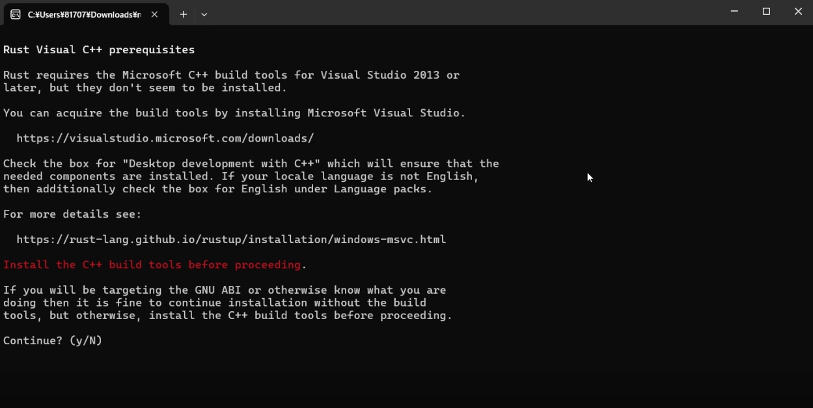
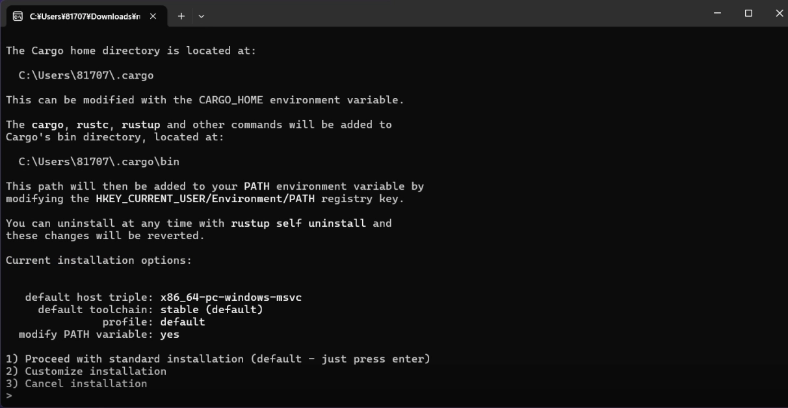
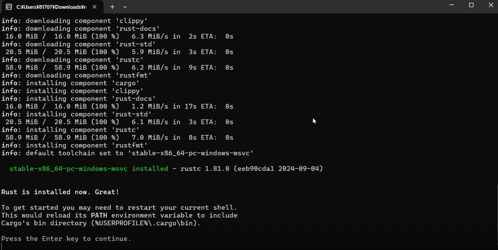
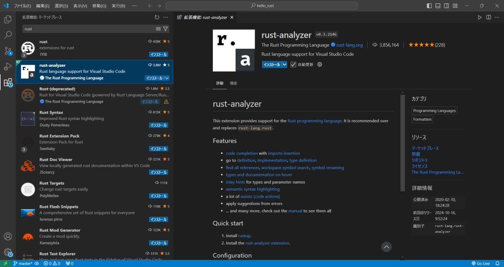
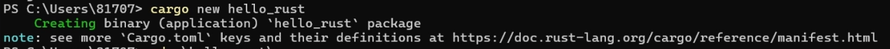
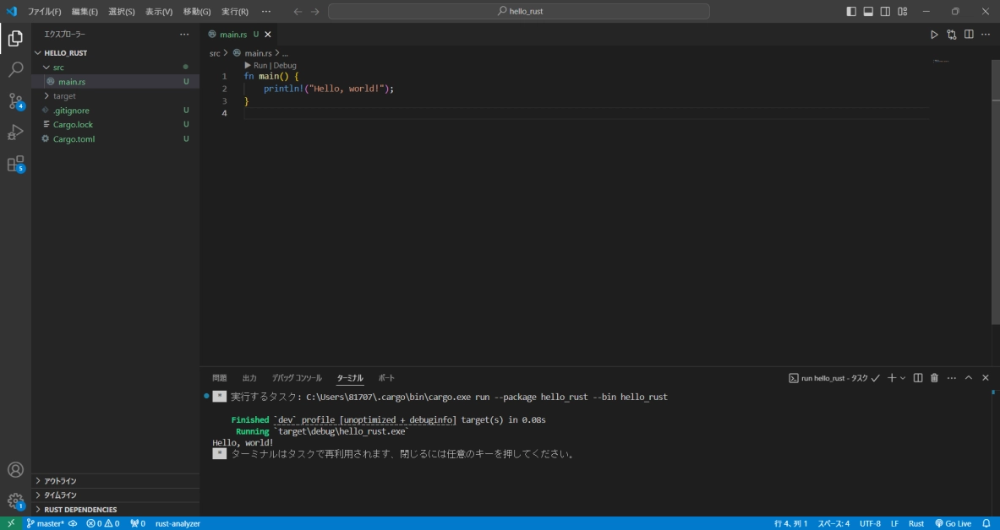
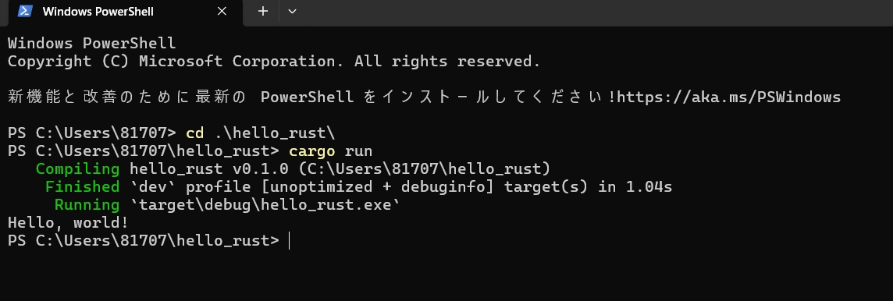

# Rustを始めるための資料
Rustを導入するための資料です。この資料ではWindowsでのRustの環境構築をサポートします。

# Rustを使う意味
Rustという言語を使う意味を一応紹介させていただきます。難しい部分があるかもしれませんが流し読みでOKです。

## 安全性
Rustは安全性を言語の仕様として保証するC言語に代わり得るシステムプログラミングに適したコンパイラ言語として存在しています。

何を言っているのかわからないと思います。簡単に言うと開発者の能力に関わらず最低限の安全性を持ったソフトウェアを開発できるよということです。

Rustのコンパイラは私的には「厳しい先生」というイメージがあります。コンパイラとは開発者が書いたプログラミング言語をPCなどが実行する機械語に変換するものを指しますが、Rustのコンパイラははっきり言って厳しいです。

C言語を書くときには軽い気持ちで書いていたことでもRustで実装してみるとコンパイルが失敗したりします。

## 静的型付言語
これについてはC言語と比較してどのような違いがあるのか決定いたします。

#### C言語
```c
int plus_five(int value)
{
    return value + 5;
}

int main(void)
{
    // int型の変数、first_valueが宣言されている。
    int first_value = 0;

    int result = plus_five(first_value);
}
```

<br><br>

#### Rust
```rs
fn plus_five(value : i32)->i32
{
    return value + 5
}

fn main()
{
    // ここでのfirst_valueは値の型が決まってない
    let first_value = 0;

    let result = plus_five(first_value);
}
```

これらはどちらもはじめに用意した***first_value***という変数に関数によって５をプラスするプログラムです。

結果は同じであっても言語的に動きが異なっています。

まずC言語の方ですが、こちらの***first_value***は宣言時にすでにint型になっています。そしてint型を引数とする***plus_five***に入力されているためエラーなしに実行されることでしょう。

ですがRustの方をみると、最初の***first_value***の宣言時には***let***というワードが変数名の前にあるだけで型のようなものは見受けられません。よってこのときの***first_value***はint型ではないのです。しかしコンパイル時には***plus_five***関数に入力されていることからRustコンパイラがint型として実行します。

# Rustの環境を構築する
RustをWindowsで開発するための環境構築をガイドします。

## VisualStudio
**Rust**ではC++コンパイラを必要するのでVisualStudio2022の更新がされていることを確認してください。

## Rustコンパイラとパッケージ管理システムをインストールする

[Rust公式サイト](https://www.rust-lang.org/tools/install)から64bitの方の.exeファイルを入手して実行してください。



このような画面が出るので「y」を入力してエンターキーを押してください。

すると色々なログが流れていきます。



そしてこのような画面が出るので「１」を押してまたエンターキーを押してください



最後にこの画面がでたらエンターキーを押して**Rust**のインストールは完了です。

## Visual Studio CodeでRustを開発する準備

次にRustをVSCodeで開発しやすくなる拡張機能を導入しましょう。
以下のように検索して***rust-analyzer***をインストールしてください。これがまじで神なので。



# Rustを動かしてみる
Rustの環境構築が完了したので軽く動作確認をしてみましょう。以下の動作は**Windows Power Shell**で行います。

## パッケージの新規作成
Rustは<u>**Cargo**</u>というシステムによってパッケージを管理しています。このシステムによって使いたいライブラリの指定やパッケージにバージョンをつけることができたり色々便利です。さらに<u>**Cargo**</u>は<u>**GitHub**</u>との相性もとても良いと思います。

Rustを開発するときには基本Cargoというシステムを扱います。以下のコマンドでRustのパッケージを新規作成してください。

```sh
cargo new [パッケージの名前]
```

今回は下のコマンドによって<u>**hello_rust**</u>というパッケージを作成しました。



するとhello_rustというフォルダが作成されていてその中には以下のファイル、フォルダが存在するはずです。

```rs
Cargo.toml // ライブラリなど依存関係を記述するファイル
src // ソースコードを入れるフォルダ
    main.rs // srcフォルダ内にある実際に実行されるファイル「.rs」が拡張子
```

## Visual Studio Codeで編集する

次にパッケージを編集する方法です。
以下のコマンドで先程作成したパッケージフォルダ内に移動してください

```sh
cd hello_rust
```

そしてそのパッケージフォルダをVisualStudioCodeで開きましょう
```sh
code .
```



まずはじめに<u>**Cargo.toml**</u>の中身を見ていきましょう。
```toml
[package]
name = "hello_rust"
version = "0.1.0"
edition = "2021"

[dependencies]

```
- **name**　：　このパッケージの名前を指定する
- **version**　：　このパッケージのバージョンを指定する
- **edition**　：　特にいじることはない

- **[dependencies]**　：　この下に使うライブラリを追記する。下は行列計算ライブラリを導入する例

```toml
[dependencies]
nalgebra = "0.33.0"
```
なんか簡単そうです。

次に<u>**src/main.rs**</u>の中身をみてみましょう。

```rs
fn main() {
    println!("Hello, world!");
}
```

なにやら「Hello, world!」と表示したそうなプログラムですね。適当に書き換えます。

```rs
fn main() {
    println!("Hello, 焦土作戦実行！！");
}
```

## 焦土作戦実行！！
それではRustのコードを実行してみましょう。もう一度 ***Windows PowerShell***を開いてください。

実行する場合には以下のコマンドです。
```sh
cargo run
```

以下のような実行結果が得られるはず。

